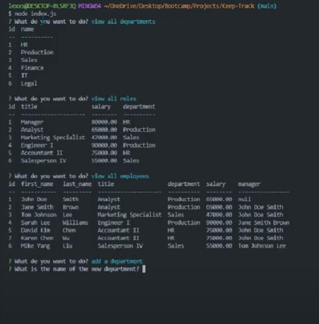

# Keep-Track

## Description 
This application focused on creating a backend database to interact with information stored with employee's information like department, roles and sarlary. The application allows you to input node index in terminal so that user can view departments, roles, and salary for each position.
Keep Track allows business owners to easily keep track of their organization's structure.
The app provides easy access to information about your team members positions, salaries, and responsibilities.

## Installation 

Installed inquirer, inqurier package mysql2 package

## User Story
AS A business owner 
I WANT to be able to view and manage the departments, roles, and employees in my company 
SO THAT I can organize and plan my business

## Acceptance Criteria
GIVEN a command-line application that accepts user input 
WHEN I start the application 
THEN I am presented with the following options: view all departments, view all roles, view  
all employees, add a department, add a role, add an employee, and update an employee role 
WHEN I choose to view all departments 
THEN I am presented with a formatted table showing department names and department ids 
WHEN I choose to view all roles 
THEN I am presented with the job title, role id, the department that role belongs to, and the 
salary for that role 
WHEN I choose to view all employees 
THEN I am presented with a formatted table showing employee data, including employee ids, first names, last names, job titles, departments, salaries, and managers that the employees report to 
WHEN I choose to add a department 
THEN I am prompted to enter the name of the department and that department is added to the database 
WHEN I choose to add a role 
THEN I am prompted to enter the name, salary, and department for the role and that role is added to the  database
WHEN I choose to add an employee 
THEN I am prompted to enter the employee’s first name, last name, role, and manager, and that employee is added to the database 
WHEN I choose to update an employee role 
THEN I am prompted to select an employee to update and their new role and this information is updated in the database

## Usage

## Links
[Video Recording](https://drive.google.com/file/d/1PI-wzcwJfE4dZUV96a48WKq41a2RFV3m/view)

[Github](https://github.com/Lexxvasquez/Keep-Track)